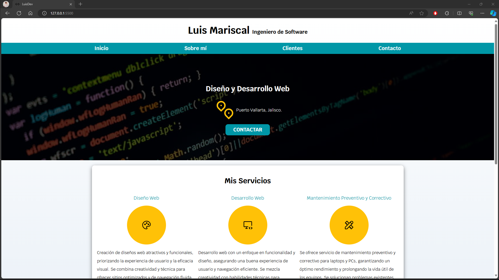

# LuisDev - Sitio Web Personal

## Descripción
Este es el código fuente de mi sitio web personal, creado con el propósito de practicar las tecnologías HTML y CSS. El sitio muestra mis servicios como Ingeniero de Software y ofrece una forma de contacto.

## Objetivo
El objetivo principal de este proyecto es practicar y mejorar mis habilidades en el desarrollo web utilizando HTML y CSS.

## Tecnologías Utilizadas
- HTML
- CSS

## Estructura de Carpetas y Archivos
```
LuisDev/
│
├── css/
│   ├── normalize.css
│   └── styles.css
│
├── img/
│   |── heo.png
│   |── icono.svg
│   └── preview.png
│
├── index.html
│
└── README.md
```

## Contenido

### Encabezado (Header)
- Nombre completo: Luis Mariscal
- Profesión: Ingeniero de Software

### Navegación Principal
- Inicio
- Sobre mí
- Clientes
- Contacto

### Sección Hero
- Título: Diseño y Desarrollo Web
- Ubicación: Puerto Vallarta, Jalisco.
- Botón de contacto

### Sección de Servicios
1. **Diseño Web**
    - Icono: Paleta de colores
    - Descripción: Creación de diseños web atractivos y funcionales.
  
2. **Desarrollo Web**
    - Icono: Computadora de escritorio con código
    - Descripción: Desarrollo web con enfoque en funcionalidad y diseño.
  
3. **Mantenimiento Preventivo y Correctivo**
    - Icono: Herramientas
    - Descripción: Mantenimiento para laptops y PCs, garantizando un óptimo rendimiento.

### Sección de Contacto
Formulario de contacto con los siguientes campos:
- Nombre
- Teléfono
- Correo electrónico
- Mensaje

### Pie de Página (Footer)
- Derechos reservados: Luis Mariscal

## Vista Previa



## Instrucciones de Uso
1. Clona este repositorio: https://github.com/LuisMariscalDev/luisdev.git
2. Abre `index.html` en tu navegador web.

## Créditos
- Iconos: [Icon Tabler](https://icontabler.com/)
- Fuentes: [Google Fonts - Krub](https://fonts.google.com/specimen/Krub)

---